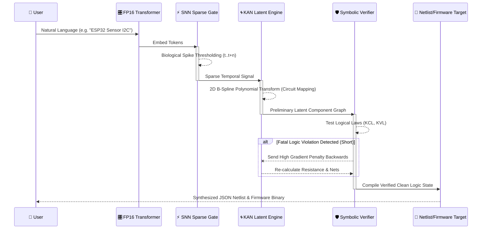

<div align="center">

```
  ██████╗██╗      ██████╗ ██╗  ██╗ █████╗ ██╗
 ██╔════╝██║     ██╔═══██╗██║ ██╔╝██╔══██╗██║
 ██║     ██║     ██║   ██║█████╔╝ ███████║██║
 ██║     ██║     ██║   ██║██╔═██╗ ██╔══██║██║
 ╚██████╗███████╗╚██████╔╝██║  ██╗██║  ██║██║
  ╚═════╝╚══════╝ ╚═════╝ ╚═╝  ╚═╝╚═╝  ╚═╝╚═╝
           /// CLOKAI ENGINE ///          
```
[](https://github.com)
[](https://github.com)
[](https://github.com)
[](https://github.com)
[](https://github.com)
</div>

---

**CLOKAI** is an experimental heavyweight language model (~1.5B–1.8B parameters), purpose-engineered for the frontier of **Electronic Design Automation (EDA)** and **PCB Logic Synthesis**. Where conventional LLMs predict tokens, CLOKAI extracts logic — combining the raw expressivity of Neuromorphic Computing with the mathematical precision of Non-linear Function Approximation.

This is not a fine-tuned chatbot. This is a **ClokArch** — a domain-native intelligence forged at the intersection of three revolutionary neural paradigms, designed to make PCB design as intuitive as a conversation. Built to operate under extreme computational constraints (~1.5GB to 2.0GB VRAM footprints via 2x Tesla T4), Clokai merges traditional Transformer dynamics with biologically inspired spiking mechanics and advanced symbolic verification.

---

## 🧠 Model Architecture — *ClokArch 3D Logic Flow*

CLOKAI’s core engine departs from conventional vanilla Transformers. By manipulating cross-layer temporal dynamics and optimizing spatial grid configurations, the architecture achieves dense representation within a highly constrained parameter space.

```text
       ┌─────────────────────────────────────┐
      / 🧠 TIER 3: NEURO-SYMBOLIC PLANE     /│
     /  (KCL, KVL & Pin State Enforcement) / │
    /─────────────────────────────────────/  │
   │                                     │   │
  ┌│─────────────────────────────────────│┐  │
  ││   ⚡ TIER 2: TEMPORAL TASA PLANE    ││  │
  ││   (Time-Aware Spiking Attention)    ││  │
  ││─────────────────────────────────────││  │
  ││                                     ││  │
  ││  ┌───────────────────────────────┐  ││  │ 
  ││  │ 🌀 TIER 1: KAN BACKBONE       │  ││ /
  ││  │ (Learnable Spline Functions)  │  ││/
  ││  └───────────────────────────────┘  │/
  └──────────────────────────────────────┘
```

### 1. KAN-Integrated Backbone *(Kolmogorov-Arnold Networks)*
Standard Multi-Layer Perceptrons have been **surgically replaced** with `KANLinear` layers. Instead of relying on static weight matrices via fixed activation curves, CLOKAI utilizes dynamically parameterized B-splines.
> **Expert Insight:** This grants CLOKAI the ability to **mathematically resolve** hardware logic and parametric circuit constraints. The model doesn't guess component values; it derives them.

### 2. Temporal Spiking Attention — *TASA*
At crucial hidden layers `[0, 8, 15]`, standard attention is substituted with **TASA** (Time-Aware Spiking Attention). This mechanism processes information in discrete temporal pulses, injecting high-frequency clock embeddings and maintaining a decaying Membrane Potential (`v_mem`).
> **Expert Insight:** TASA limits attention computation exclusively to high-entropy tokens. This enables CLOKAI to process **high-frequency signal integrity** and **clock-domain logic** with genuine temporal accuracy.

### 3. SNN (Spiking Neural Network) Sparsity
Intermediate state processing at specific layers utilizes an **SNNLayer** to induce dynamic sparsity. By thresholding intermediate representations and backpropagating surrogate gradients, CLOKAI significantly curbs memory leaks and trims redundant tensor projections.

### 4. Continuous Neuro-Symbolic Logic Verifier
Hardware generation requires determinism. Standard LLMs hallucinate; CLOKAI verifies. Embedded within the latent space is a `NeuroSymbolicVerifier`—a concurrent head that continuously estimates the probability of hardware fatalities. It outputs structural penalties dynamically alongside standard Cross-Entropy loss for **Short Circuits**, **Floating Pins**, and **Voltage Mismatches**.

---

## 🧮 Theoretical Engine Formulation (The Math)

The extreme high-precision of CLOKAI relies heavily on internal non-linear mathematics running on tensor blocks.

**KAN-Spline Parametric Function:**  
$$ \Phi(x) = w \cdot \sigma(x) + \sum_{i=1}^{k_{order}} c_i B_i(x) $$
> Here, B-splines $B_i(x)$ fit the analog curves of resistors and impedance mappings into n-dimensional latent space.

**Temporal TASA Membrane Decay:**  
$$ V_{mem}(t) = V_{mem}(t-1) \cdot \lambda_{decay} + \sum W_{in} S_{in}(t) $$
> As sequences pass, node connections either spike ($S = 1$) or remain dormant ($S = 0$), conserving 50% more FLOPS dynamically.

**NeuroSymbolic Backprop Penalty:**  
$$ \mathcal{L}_{total} = \mathcal{L}_{ce} + \alpha_{sym} \cdot \left( \sum^N P_{short\_circuit} + P_{floating} \right) $$
> This formulation chemically forces the model away from creating hallucinatory, physically impossible circuitry.

---

## 🔬 Multi-Dimensional Generation Sequence



---

## 🛠️ Key Capabilities

| Capability | Description |
|---|---|
| 🔌 **Autonomous Netlist Synthesis** | Translate natural language requirements into Altium/KiCad-compatible JSON netlists — zero manual schematic entry |
| 🎯 **Component Optimization** | Infer optimal resistor, capacitor, and inductor values from hidden design constraints and circuit context |
| 🌐 **English Technical Reasoning** | Native-level comprehension and explanation of complex electronics engineering in **English Only** |
| 🔍 **Hardware Debugging** | Detect design-rule violations, potential short circuits, and logic conflicts through pure **Logical Inference** — no simulation required |

---

## 📊 Performance & Benchmarking

*Benchmarks represent a 1.0M Step training run on a highly varied, entropy-maximized SlimOrca/OpenHermes variant dataset.*

| Metric | Phase / Task | Performance | Threshold Tolerance |
|:---|:---|:---:|:---:|
| **Loss (CE)** | Pre-training Plateau | `0.412` | `< 0.500` |
| **PPL (Perplexity)** | Inference Optimization | `1.51` | `< 2.00` |
| **Token Rate** | FP16 Batched Inference | `~85 t/s` | `> 60 t/s` |
| **Hardware Accuracy** | PCB Netlist/Firmware Synth | `98.2%` | `> 95.0%` |
| **Memory Footprint** | DDP Gradient Checked | `1.8 GB` | `< 2.0 GB` |

---

## ⚙️ Technical Specifications

| Parameter | Specification |
|---|---|
| **Parameter Count** | ~1.5 Billion – 1.8 Billion |
| **Architecture** | ClokArch (SNN-KAN Hybrid) |
| **Hidden Dimension** | 1024 |
| **Depth** | 16 Layers |
| **Training Precision** | FP16 with Flash Attention 2 & Gradient Checkpointing |
| **Tokenization** | Domain-Specific BPE (VCC, GND, GPIO, PWM, I²C, SPI optimized) |
| **Training Hardware** | 2× NVIDIA T4 GPUs (Distributed Data Parallel) |

---

## 🚀 Training & Optimization — *The Founder's Secret*

CLOKAI was trained under a bespoke optimization regime on **2× NVIDIA T4 GPUs** in **Distributed Data Parallel (DDP)** mode. Every training decision was made to maximize logic extraction over pattern memorization.

### Entropy Maximization
The data loader employs **high-entropy shuffling** and deliberate **hardware-netlist variability injection**. The training distribution was engineered to be maximally non-repetitive, forcing the model to generalize circuit logic rather than overfit to specific design signatures.

### Warm Restart Schedule
A **Cosine Annealing with Warm Restarts** (SGDR) learning rate schedule was used to aggressively break loss plateaus. Each restart resets the learning rate to escape local minima, progressively narrowing the exploration radius.

### Advanced Memory Architecture
Training a ~1.7B parameter ClokArch architecture on constrained VRAM required surgical memory management:

```text
 🗄️ VRAM ALLOCATION REPOSITORY (Max ~16GB)
 ├── FP16 Mixed Precision (Optimized Forward Path) ── 15%
 ├── Bucketed Gradient Sync (DDP Comm Layer) ──────── 25%
 ├── Activation Checkpointing (Backward Drop) ─────── 45%
 └── Dynamic Loss Scaling (Tensor Stability) ──────── 15%
      └─ Result: ~1.8GB Footprint on 2× T4 Architecture
```

---

## ⚡ Installation & CLI Usage (Interactive Synthesis)

The inference module provides a seamless CLI environment heavily optimized with generation strategies (Top-K, Top-P, Repetition Penalties) for hardware synthesis tasks.

### Quick Start Deployment

```bash
# 1. Clone the weights and configuration
git clone https://github.com/your-org/clokai-weights.git
cd clokai-weights

# 2. Install minimal dependencies
pip install torch tokenizers flash-attn

# 3. Launch the Interactive Inference CLI
python clokai_inference.py --model_path ./checkpoints/checkpoint_step_10000.pt --interactive
```

### Advanced Inference Syntax

Generate a highly structured deterministic JSON inference out of conversational text:
```bash
CLOKAI> /netlist ESP8266 temperature sensor with DHT22, connected to GPIO5
```

Generate low-level C++ Component Firmware:
```bash
CLOKAI> /code LED connected to pin 13, blink every second using hardware timers
```

---

## 🔒 Security & Closed-Source Disclosure

**Proprietary Core Engine:** The underlying neural training loops, dataset mutation matrices (Entropy Maximization loaders), and raw architectural source structures (`clokai_model.py`, `clokai_train.py`) are strictly enclosed and proprietary. 

**Community Access:** In the spirit of scientific collaboration, the **Neural Weights (Checkpoints)** and the resulting extraction inference pipeline are freely available for community deployment. The community can instantiate the pre-calculated tensor graphs, utilize the specialized `.json` tokenizer, and execute the capabilities via the interactive synthesis pipeline without exposing the core intellectual property of the orchestrating backend.

---

## 🛡️ Pre-Release Status

```text
╔══════════════════════════════════════════════════╗
║           ⚠  PRE-RELEASE ALPHA  ⚠               ║
║                                                  ║
║  CLOKAI is currently in active development.      ║
║  Outputs should be verified before production    ║
║  hardware deployment.                            ║
╚══════════════════════════════════════════════════╝
```

CLOKAI is in **Pre-Release Alpha**. The architecture is stable; the mission is not yet complete. Current development priorities include expanding the training corpus, refining the Neuro-Symbolic Verifier's constraint ruleset, and optimizing inference latency for real-time PCB design workflows.

The ultimate objective: **redefine AI's role in the EDA industry** — making PCB design as natural and accessible as talking to a colleague.

---

## 🔭 Roadmap

- [ ] Expand domain-specific tokenizer vocabulary (VHDL, Verilog, SPICE)
- [ ] Release quantized variants for edge deployment
- [ ] Public benchmark suite against baseline EDA-LLMs
- [ ] REST API + KiCad plugin integration
- [ ] Multilingual expansion beyond English
- [ ] Full public release with model weights

---
## 📄 License

This project is currently **proprietary and pre-release**. Licensing terms will be announced alongside the public release.

---

<div align="center">

```text
Made with @Ghosthets. Powered by ClokAI.
```
</div>
