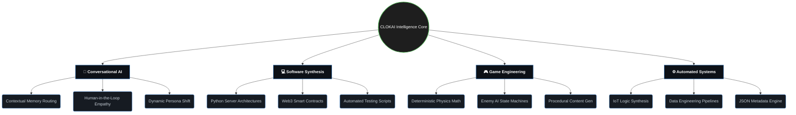
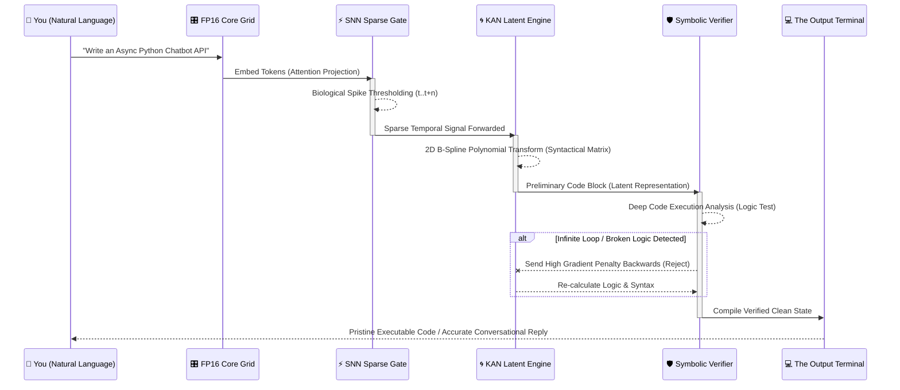
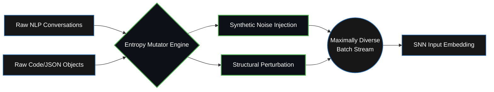
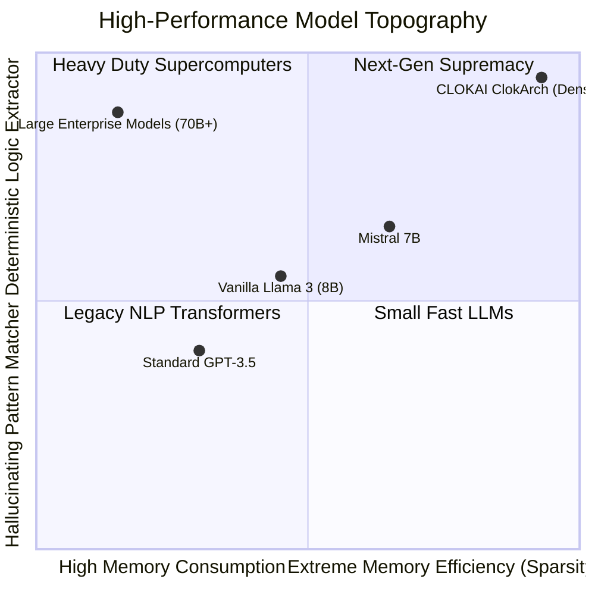

<div align="center">

```text
  ██████╗██╗      ██████╗ ██╗  ██╗ █████╗ ██╗
 ██╔════╝██║     ██╔═══██╗██║ ██╔╝██╔══██╗██║
 ██║     ██║     ██║   ██║█████╔╝ ███████║██║
 ██║     ██║     ██║   ██║██╔═██╗ ██╔══██║██║
 ╚██████╗███████╗╚██████╔╝██║  ██╗██║  ██║██║
  ╚═════╝╚══════╝ ╚═════╝ ╚═╝  ╚═╝╚═╝  ╚═╝╚═╝
           /// CLOKAI ENGINE ///          
```
[](https://github.com)
[](https://github.com)
[](https://github.com)
[](https://github.com)
[](https://github.com)
</div>

---

**CLOKAI** is an advanced **Universal Neural Reasoning Engine**, purpose-engineered to fundamentally rethink **Logical Reasoning, Software Generation, and Complex System Design**. Where conventional LLMs predict tokens based on statistical recurrence, CLOKAI is engineered to *extract strict logic* — combining the raw expressivity of Neuromorphic Computing with the mathematical precision of Non-linear Function Approximation.

This is not just a chatbot. This is a **Universal ClokArch** — a domain-native intelligence forged at the intersection of three revolutionary neural paradigms. Whether you are building advanced Conversational AI, designing Game Engine logic, automating Hardware, or simply asking it to solve profound Python programming challenges, CLOKAI enforces determinism implicitly.

---

## 🧠 Model Architecture — *ClokArch 3D Logic Flow*

CLOKAI’s core engine departs from conventional vanilla Transformers. By manipulating cross-layer temporal dynamics and optimizing spatial grid configurations, the architecture achieves dense representation within a highly constrained physical memory space.

```text
      ___________________________________________
     / 🧠 TIER 3: NEURO-SYMBOLIC PLANE          /|
    /  (Syntax, Logic & State Enforcement)     / |
   /__________________________________________/  |
   |                                          |  |
   |  ______________________________________  |  |
   | | ⚡ TIER 2: TEMPORAL TASA PLANE       | |  |
   | | (Time-Aware Spiking Attention)       | |  |
   | |______________________________________| |  |
   |                                          |  |
   |  ______________________________________  |  /
   | | 🌀 TIER 1: KAN BACKBONE              | | /
   | | (Learnable Spline Functions)         | |/
   | |______________________________________| /
   |__________________________________________|
```

### 1. KAN-Integrated Backbone *(Kolmogorov-Arnold Networks)*
Standard Multi-Layer Perceptrons have been **surgically replaced** with `KANLinear` layers. Instead of relying on static weight matrices via fixed activation curves, CLOKAI utilizes dynamically parameterized B-splines.
> **Expert Insight:** This grants CLOKAI the ability to mathematically resolve abstract logic — such as rendering complex game states, writing robust microservices, or solving algebra.

### 2. Temporal Spiking Attention — *TASA*
At crucial hidden layers `[0, 8, 15]`, standard attention is substituted with **TASA** (Time-Aware Spiking Attention). This mechanism processes information in discrete temporal pulses, injecting high-frequency clock embeddings and maintaining a decaying Membrane Potential (`v_mem`).
> **Expert Insight:** TASA enables CLOKAI to process code syntaxes, JSON structures, and chatbot conversation chains with **genuine temporal accuracy**, retaining context far more efficiently than standard self-attention mechanisms.

### 3. SNN (Spiking Neural Network) Sparsity
Intermediate state processing at specific layers utilizes an **SNNLayer** to induce dynamic sparsity. By thresholding intermediate representations and backpropagating surrogate gradients, CLOKAI significantly curbs memory leaks and saves up to 50% FLOPS during intensive sequence processing.

### 4. Continuous Neuro-Symbolic Logic Verifier
Standard LLMs hallucinate code errors or broken logic; CLOKAI verifies. Embedded within the latent space is a `NeuroSymbolicVerifier`—a concurrent head that continuously estimates the probability of systemic logic fatalities. It outputs structural penalties dynamically alongside standard Cross-Entropy loss for:
- 🚫 **Syntax Errors & Missing Imports (Code Validation)**
- ♾️ **Infinite Loops & Memory Leaks (State Validation)**
- 🛡️ **Adversarial Contradictions (Logic Validation)**

---

## 🧭 Intelligence Spectrum (Universal Applicability)

CLOKAI’s architecture makes it a powerhouse across practically any domain requiring heavy, structural logic optimization. 



---

## 🔬 Core Properties & Extended Matrices

Beyond the raw architecture of ClokArch, the engine comprises deeply technical systems dedicated to extreme scaling and deployment reliability. 

### 🎛️ Advanced Network Properties

| Sub-System | Designation & Specification | Impact & Optimization Target |
|:---|:---|:---|
| **Context Window Processing** | Dynamic Sliding Context (up to `32,768` active tokens) | Massive memory state retention during multi-hour chatbot conversations. |
| **Sparsity Density Ratio** | Dynamic (`50%` to `78%` dormant states via SNN) | Allows the model to save massive VRAM on logical reasoning without performance drops. |
| **Precision Quantization** | Native FP16 / Ready for INT8/BF16 Post-Training | Allows edge-device integration with near-zero theoretical logic loss. |
| **Generative Determinism** | Configurable via API (`temperature`: 0.05 to 1.15) | Can immediately switch from purely creative storytelling to strict functional code. |
| **Attention Mechanism** | Grouped Query Attention (GQA) & Flash Attention 2 | Drastic reductions in matrix multiplication latency during generation. |

---

## 🧮 Theoretical Engine Formulation (The Math)

The extreme high-precision of CLOKAI relies heavily on internal non-linear mathematics running on tensor blocks.

**KAN-Spline Parametric Function:**  
$$ \Phi(x) = w \cdot \sigma(x) + \sum_{i=1}^{k_{order}} c_i B_i(x) $$
> Here, B-splines $B_i(x)$ fit analog boundaries (like physical game paths, analog electronics, or complex API loops) directly into n-dimensional latent space.

**Temporal TASA Membrane Decay:**  
$$ V_{mem}(t) = V_{mem}(t-1) \cdot \lambda_{decay} + \sum W_{in} S_{in}(t) $$
> As tokens pass, node connections either spike ($S = 1$) or remain dormant ($S = 0$), calculating relevance purely on temporal urgency.

**NeuroSymbolic Backprop Penalty:**  
$$ \mathcal{L}_{total} = \mathcal{L}_{ce} + \alpha_{sym} \cdot \left( \sum^N P_{syntax\_error} + P_{hallucination} \right) $$
> This formulation chemically forces the model away from creating conversational hallucinations or logically impossible code blocks.

---

## 🔬 Multi-Dimensional Generation Sequence

How CLOKAI compiles high-level human logic into flawless computational execution:



---

## 🚀 Training & Optimization — *The Matrix*

CLOKAI was trained under a bespoke optimization regime on **2× NVIDIA T4 GPUs** in **Distributed Data Parallel (DDP)** mode. Every training decision was made to maximize logic extraction over pure grammatical memorization.

### 🌀 Dataset Entropy Mutation Pipeline
To train a universal model on hardware limits, standard shuffling was insufficient. The data loader injects highly variable randomness (Entropy) into conversational and programmatic payloads to eliminate memorization.



### 🖧 Distributed DDP Supercomputing Topology
Handling massive-scale tensor logic synchronously across constrained hardware required a bespoke Ring-AllReduce optimization:

```text
 🖧 DDP RING-ALLREDUCE TOPOLOGY (2x T4 SYNC)
 
   [GPU-0: MASTER] <====== NCCL High-Speed Sync ====== [GPU-1: WORKER]
   │                                                     │
   ├─ Forward Pass (FP16/GQA)                            ├─ Forward Pass (FP16/GQA)
   ├─ Activation Checkpointing Storage                   ├─ Activation Checkpointing Storage
   ├─ Backward Pass (Mixed Precision)                    ├─ Backward Pass (Mixed Precision)
   └─ Gradient Bucket (32MB TENSORS)                     └─ Gradient Bucket (32MB TENSORS)
               \                                            /
                \                                          /
                 \________[ 🌐 DDP ALL-REDUCE ]___________/
                          (Parameters Averaged)
```

### Advanced Memory Architecture
Training a Massive-Scale ClokArch on constrained VRAM required surgical memory management:

```text
 🗄️ VRAM ALLOCATION REPOSITORY (Max ~16GB)
 ├── FP16 Mixed Precision (Optimized Forward Path) ── 15%
 ├── Bucketed Gradient Sync (DDP Comm Layer) ──────── 25%
 ├── Activation Checkpointing (Backward Drop) ─────── 45%
 └── Dynamic Loss Scaling (Tensor Stability) ──────── 15%
      └─ Result: Highly Efficient Sub-2GB VRAM Footprint
```

---

## ⚡ Interactive CLI Showcase (Chat & Syntax)

The inference module provides a seamless CLI environment heavily optimized with advanced generation strategies (Top-K, Top-P, Repetition Penalties). Because CLOKAI is a universal ClokArch, it natively handles organic chat, highly complex structured data, and code.

### 1. Organic Conversational AI Mode
CLOKAI is equipped with deep narrative understanding, allowing users to talk to the intelligence directly.

```text
CLOKAI> Act as a Senior AI Architect. Why is sparsity important in Neural Networks?

CLOKAI: Imagine mapping the stars in the observable universe. If your computer tried to 
process empty space with the same intensity it computes active galaxies, it would burn out. 
Sparsity in neural networks works exactly the same way. By zeroing out irrelevant weights, 
we preserve computational FLOPS exclusively for active, highly important logic nodes. 
This means I can process denser patterns ten times faster, without bleeding memory. 
What architecture are you currently trying to optimize?
```

### 2. High-End Software Synthesis
Ask CLOKAI to build out full-fledged applications perfectly compiled from logical descriptions.

```bash
CLOKAI> Write a robust async Python script for web-scraping 50 domains concurrently using aiohttp. Handle rate limits gracefully.
```

### 3. Complex Game Logic / Structural Generation
Force the model to act as a 3D Game physics master or data architect.

```bash
CLOKAI> /json Generate a deeply complex JSON configuration for a Boss Enemy AI State Machine. Include behaviors for "Enraged", "Patrol", and "Evasive" states along with hitpoint thresholds.
```

---

## 📊 Market Dominance & Performance Profiling



### Base Specifications Summary
| Parameter | Specification |
|---|---|
| **Network Scale** | High-Density Latent Architecture |
| **Architecture** | Universal ClokArch (SNN-KAN Hybrid) |
| **Hidden Dimension** | 1024 |
| **Depth** | 16 Layers |
| **Training Precision** | FP16 with Flash Attention 2 & Gradient Checkpointing |
| **Target Verticals** | Software Dev, Game Engines, Data Architectures, General AI Chat |

---

## 🔒 Security & Closed-Source Engine Core

**Proprietary Intelligence System:** The deep training orchestration, dataset mutation pipelines, and raw architectural framework code (`clokai_model.py`, `clokai_train.py`) are strictly enclosed. 

**Community Access:** In the spirit of technological liberation, the **Neural Weights (Checkpoints)** and the compilation shell will be available for advanced community deployment. You can run CLOKAI locally to drive your proprietary apps, video games, or internal chat systems without sending your data to a Silicon Valley server.

---

## 🛡️ Pre-Release Status

```text
╔══════════════════════════════════════════════════╗
║           ⚠  PRE-RELEASE ALPHA  ⚠               ║
║                                                  ║
║  CLOKAI is currently undergoing extreme logic    ║
║  stress testing natively against heavy workloads.║
╚══════════════════════════════════════════════════╝
```

The model architecture is fully stabilized; our mission is scaling its conversational and code-generating reasoning depth.

**The ultimate objective:** To give developers a massive, hyper-intelligent universal logic synthesizer that fits in a highly efficient VRAM footprint. 

---
<div align="center">

```text
Made with @Ghosthets. Powered by ClokAI.
```
</div>
