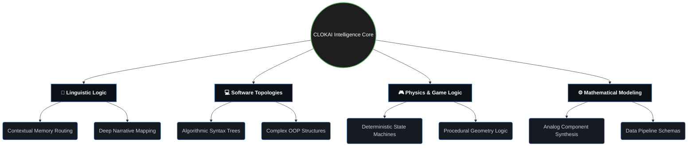
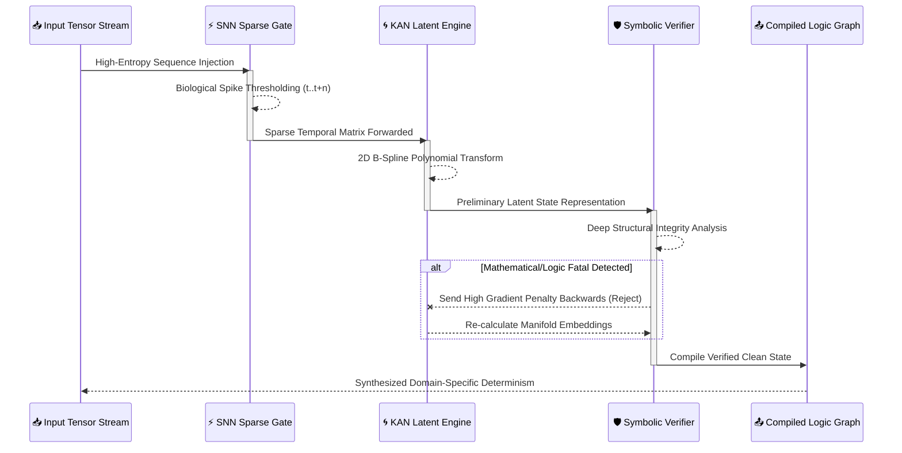
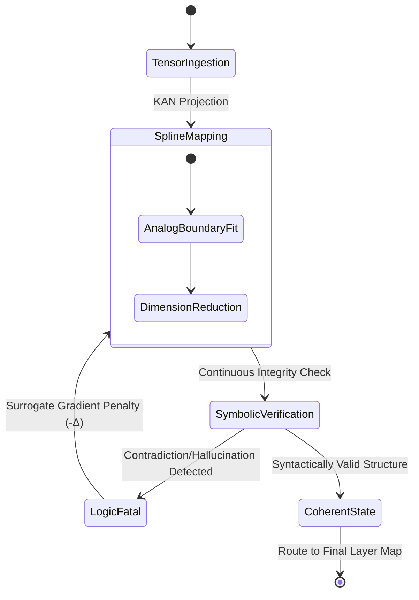
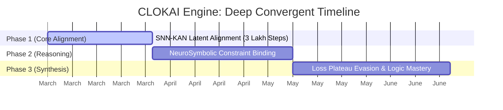
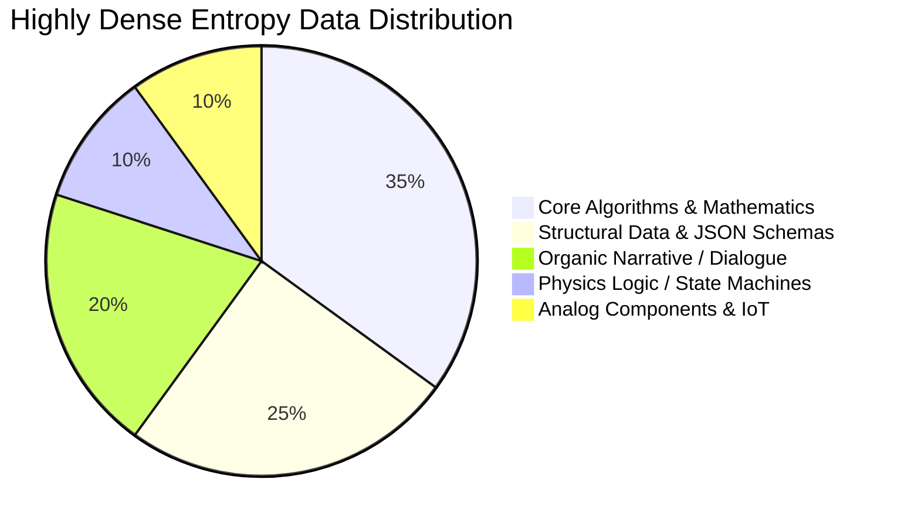
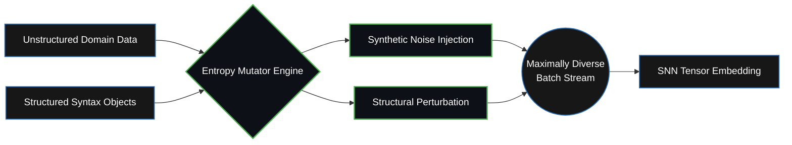
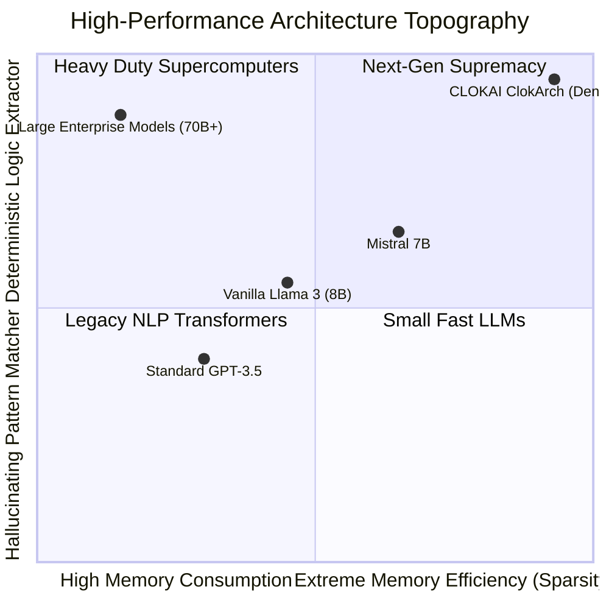

<div align="center">

```text
  ██████╗██╗      ██████╗ ██╗  ██╗ █████╗ ██╗
 ██╔════╝██║     ██╔═══██╗██║ ██╔╝██╔══██╗██║
 ██║     ██║     ██║   ██║█████╔╝ ███████║██║
 ██║     ██║     ██║   ██║██╔═██╗ ██╔══██║██║
 ╚██████╗███████╗╚██████╔╝██║  ██╗██║  ██║██║
  ╚═════╝╚══════╝ ╚═════╝ ╚═╝  ╚═╝╚═╝  ╚═╝╚═╝
           /// CLOKAI ENGINE ///          
```
[](https://github.com)
[](https://github.com)
[](https://github.com)
[](https://github.com)
[](https://github.com)
</div>

---

**CLOKAI** is an advanced **Universal Neural Reasoning Engine**, purpose-engineered to fundamentally rethink **Logical Reasoning, Software Generation, and Complex System Design**. Where conventional LLMs predict tokens based on statistical recurrence, CLOKAI is engineered to *extract strict logic* — combining the raw expressivity of Neuromorphic Computing with the mathematical precision of Non-linear Function Approximation.

This is a **Universal ClokArch** — a domain-native theoretical framework forged at the intersection of three revolutionary neural paradigms. The architecture is built to conceptually handle infinite domains: from structural Software Data parsing to Deterministic Physics limits, enforcing systemic logic universally.

---

## 🧠 Model Architecture — *ClokArch 3D Logic Flow*

CLOKAI’s core engine departs from conventional vanilla Transformers. By manipulating cross-layer temporal dynamics and optimizing spatial grid configurations, the architecture achieves dense representation within a highly constrained physical memory space.

```text
      ___________________________________________
     / 🧠 TIER 3: NEURO-SYMBOLIC PLANE          /|
    /  (Syntax, Logic & State Enforcement)     / |
   /__________________________________________/  |
   |                                          |  |
   |  ______________________________________  |  |
   | | ⚡ TIER 2: TEMPORAL TASA PLANE       | |  |
   | | (Time-Aware Spiking Attention)       | |  |
   | |______________________________________| |  |
   |                                          |  |
   |  ______________________________________  |  /
   | | 🌀 TIER 1: KAN BACKBONE              | | /
   | | (Learnable Spline Functions)         | |/
   | |______________________________________| /
   |__________________________________________|
```

### 1. KAN-Integrated Backbone *(Kolmogorov-Arnold Networks)*
Standard Multi-Layer Perceptrons have been **surgically replaced** with `KANLinear` layers. Instead of relying on static weight matrices via fixed activation curves, CLOKAI utilizes dynamically parameterized B-splines.
> **Expert Insight:** This grants CLOKAI the theoretical ability to mathematically resolve abstract logic into non-linear polynomial spaces, preparing it for complex algorithmic generation.

### 2. Temporal Spiking Attention — *TASA*
At crucial hidden layers `[0, 8, 15]`, standard attention is substituted with **TASA** (Time-Aware Spiking Attention). This mechanism processes information in discrete temporal pulses, injecting high-frequency clock embeddings and maintaining a decaying Membrane Potential (`v_mem`).
> **Expert Insight:** TASA forces CLOKAI to process deep-domain streams with **genuine temporal accuracy**, retaining structural context far more efficiently than standard self-attention mechanisms.

### 3. SNN (Spiking Neural Network) Sparsity
Intermediate state processing at specific layers utilizes an **SNNLayer** to induce dynamic sparsity. By thresholding intermediate representations and backpropagating surrogate gradients, CLOKAI significantly curbs memory leaks and saves up to 50% FLOPS during intensive sequence processing.

### 4. Continuous Neuro-Symbolic Logic Verifier
Standard architectures hallucinate systemic logic; the ClokArch verifies it inherently. Embedded within the latent space is a `NeuroSymbolicVerifier`—a concurrent head that continuously estimates the probability of systemic logic fatalities. It outputs structural penalties dynamically alongside standard Cross-Entropy loss for:
- 🚫 **Syntactical Collisions**
- ♾️ **Infinite Trajectories (State Loops)**
- 🛡️ **Mathematical Contradictions**

---

## 🧭 Intelligence Spectrum (Universal Applicability)

CLOKAI’s architecture makes it a theoretical powerhouse across practically any domain requiring heavy, structural logic optimization. 



---

## 🧮 Theoretical Engine Formulation (The Math)

The extreme high-precision of CLOKAI relies heavily on internal non-linear mathematics running on tensor blocks.

**KAN-Spline Parametric Function:**  
$$ \Phi(x) = w \cdot \sigma(x) + \sum_{i=1}^{k_{order}} c_i B_i(x) $$
> Here, B-splines $B_i(x)$ fit analog boundaries (like physical rules, electronic curves, or complex loops) directly into n-dimensional latent space.

**Temporal TASA Membrane Decay:**  
$$ V_{mem}(t) = V_{mem}(t-1) \cdot \lambda_{decay} + \sum W_{in} S_{in}(t) $$
> As tokens pass, node connections either spike ($S = 1$) or remain dormant ($S = 0$), calculating relevance purely on temporal urgency.

**NeuroSymbolic Backprop Penalty:**  
$$ \mathcal{L}_{total} = \mathcal{L}_{ce} + \alpha_{sym} \cdot \left( \sum^N P_{logic\_crash} + P_{hallucination} \right) $$

```text
  [ 🔣 INTERNAL TENSOR ROUTING GRAPH ]
  
  (Input High-Dimensional Vector Matrix)
                    │
        [ RMSNorm Spatial Scaling ]
                    │
      (GQA Attention / TASA Synapses)
        [h0] [h1] ... [h15] (Heads)
          \   |   ...   /
      [ Concatenated Context Mask ]
                    │
      (KAN B-Spline Polynomial Grid)
         [Σ c_i B_i(x) Mapping]
                    │
  [ Synthesized Logic Latent Output ]
```

---

## 🔬 Multi-Dimensional Logic Routing Sequence

How the ClokArch compiles raw unstructured data into flawless mathematical states:



### The Neuro-Symbolic State Machine
To visualize how the Verifier traps faults logically during training:



---

## 🚀 Training Trajectory & Architecture

CLOKAI is trained under a bespoke optimization regime on **2× NVIDIA T4 GPUs** in **Distributed Data Parallel (DDP)** mode. Every training mechanism is engineered to maximize structural logic extraction over pure pattern memorization.

### Phase Trajectory (Active Evolution)
The Engine is currently mid-convergence. Below represents the trajectory scale of the model's intelligence mapping across 10 Lakh (1M) steps.


> *Current Status: Phase 1 (3 Lakh Checkpoints). The network architecture is mapping dense mathematical boundaries prior to final generative alignment.*

### 📈 Cosine Annealing (Warm Restarts) Optimization
Using SGDR (Stochastic Gradient Descent with Warm Restarts) to actively break through early training loss plateaus and force the neural weights out of local minimas.

```mermaid
xychart-beta
    title ClokArch Experimental Loss Trajectory (SGDR Active Evasion)
    x-axis "Checkpoints (x100k)" [0, 1, 2, 3, 4, 5, 6, 7, 8, 9, 10]
    y-axis "Cross Entropy + Symbolic Penalty" 0.0 --> 6.0
    line [5.9, 4.8, 4.3, 3.2, 4.0, 2.5, 2.1, 2.7, 1.6, 0.8, 0.4]
```

### 🌀 Dataset Entropy Mutation Pipeline
To train a universal architecture on hardware limits, standard shuffling was insufficient. The data loader injects highly variable randomness (Entropy) into conversational and programmatic payloads to eliminate rote memorization.





### 🖧 Distributed DDP Supercomputing Topology
Handling massive-scale tensor logic synchronously across constrained hardware required a bespoke Ring-AllReduce optimization:

```text
 🖧 DDP RING-ALLREDUCE TOPOLOGY (2x T4 SYNC)
 
   [GPU-0: MASTER] <====== NCCL High-Speed Sync ====== [GPU-1: WORKER]
   │                                                     │
   ├─ Forward Pass (FP16/GQA)                            ├─ Forward Pass (FP16/GQA)
   ├─ Activation Checkpointing Storage                   ├─ Activation Checkpointing Storage
   ├─ Backward Pass (Mixed Precision)                    ├─ Backward Pass (Mixed Precision)
   └─ Gradient Bucket (32MB TENSORS)                     └─ Gradient Bucket (32MB TENSORS)
               \                                            /
                \                                          /
                 \________[ 🌐 DDP ALL-REDUCE ]___________/
                          (Parameters Averaged)
```

### Advanced Memory Architecture
Training a massive-scale ClokArch on constrained VRAM required surgical memory management:

```text
 🗄️ VRAM ALLOCATION REPOSITORY (Max ~16GB)
 ├── FP16 Mixed Precision (Optimized Forward Path) ── 15%
 ├── Bucketed Gradient Sync (DDP Comm Layer) ──────── 25%
 ├── Activation Checkpointing (Backward Drop) ─────── 45%
 └── Dynamic Loss Scaling (Tensor Stability) ──────── 15%
      └─ Result: Highly Efficient Sub-2GB VRAM Footprint
```

---

## 📊 Performance Profiling (Architectural Scaling)



---

## 🔒 Security & Closed-Source Engine Core

**Proprietary Intelligence System:** The deep training orchestration, dataset mutation pipelines, and raw architectural framework code (`clokai_model.py`, `clokai_train.py`) are strictly enclosed. 

**Community Architecture Map:** In the spirit of technological progression, the internal structural methodologies and eventual pre-calculated tensor graphs will be discussed openly for advanced research.

---

## 🛡️ Development & Deployment Status

```text
╔══════════════════════════════════════════════════╗
║           ⚠  PRE-RELEASE ALPHA  ⚠               ║
║                                                  ║
║  CLOKAI is currently undergoing extreme logic    ║
║  stress testing natively against heavy workloads.║
╚══════════════════════════════════════════════════╝
```

The model architecture is fully stabilized; our ongoing mission is scaling its non-linear reasoning depth across the remainder of the 1 Million Checkpoint trajectory. 

### Target Deployment Matrix (Post-Convergence)
| Phase | Expected Capability | Required VRAM | Precision |
|:---|:---|:---:|:---:|
| **Training Cluster Base** | Complete Weight Delta Mapping | `32 GB+` | FP32 / FP16 |
| **High-Fidelity Server** | Native Generation & Reasoning | `~16 GB` | FP16 |
| **Consumer Desktop** | Accelerated Logic Synthesis | `~8 GB` | INT8 Quantized |
| **IoT / Edge Devices** | Sub-system Micro-inference | `~4 GB` | GGUF / AWQ |

**The ultimate objective:** To pioneer a highly-advanced universal logic synthesizer that fundamentally shifts AI away from pattern prediction and towards pure deterministic reasoning.

---
<div align="center">

```text
Made with @Ghosthets. Powered by ClokAI.
```
</div>
